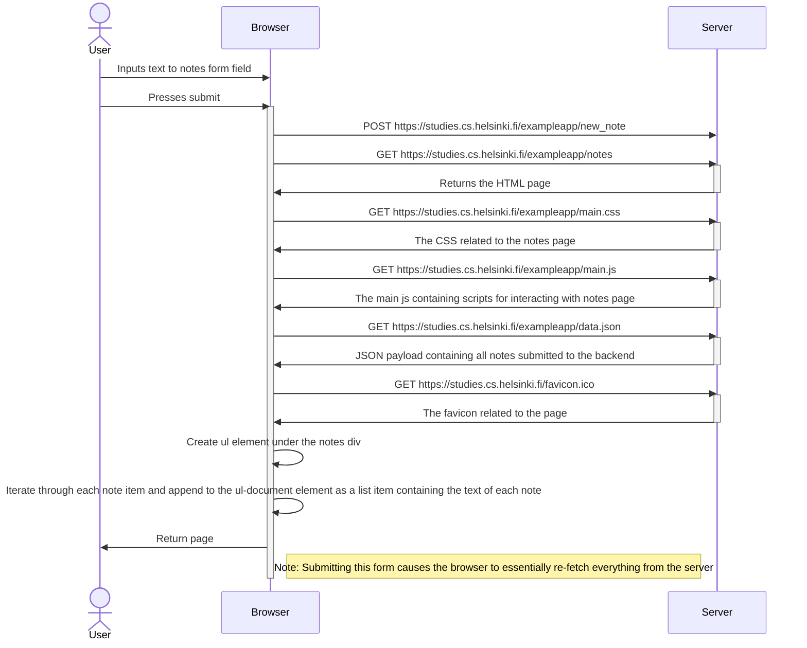

## Answer

```mermaid
  sequenceDiagram
    actor User;
    participant Browser;
    participant Server;

    User ->> Browser: Inputs text to notes form field;
    User ->> Browser: Presses submit
    activate Browser;
    Browser ->> Server: POST https://studies.cs.helsinki.fi/exampleapp/new_note

    Browser ->> Server: GET https://studies.cs.helsinki.fi/exampleapp/notes
    activate Server;
    Server ->> Browser:  Returns the HTML page
    deactivate Server;

    Browser ->> Server: GET https://studies.cs.helsinki.fi/exampleapp/main.css
    activate Server;
    Server ->> Browser:  The CSS related to the notes page
    deactivate Server;

    Browser ->> Server: GET https://studies.cs.helsinki.fi/exampleapp/main.js
    activate Server;
    Server ->> Browser:  The main js containing scripts for interacting with notes page
    deactivate Server;

    Browser ->> Server: GET https://studies.cs.helsinki.fi/exampleapp/data.json
    activate Server;
    Server ->> Browser:  JSON payload containing all notes submitted to the backend
    deactivate Server;

    Browser ->> Server: GET https://studies.cs.helsinki.fi/favicon.ico
    activate Server;
    Server ->> Browser:  The favicon related to the page
    deactivate Server;

    Browser ->> Browser: Create ul element under the notes div

    Browser ->> Browser: Iterate through each note item and append to the ul-document element as a list item containing the text of each note

    Browser ->> User: Return page
    Note right of Browser: Note: Submitting this form causes the browser to essentially re-fetch everything from the server

    deactivate Browser;


```
