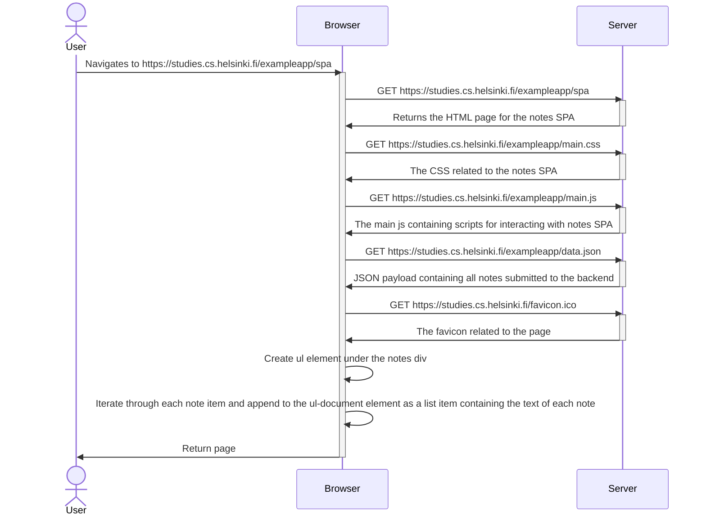

## Answer

```mermaid
  sequenceDiagram
    actor User;
    participant Browser;
    participant Server;

    User ->> Browser: Navigates to https://studies.cs.helsinki.fi/exampleapp/spa;

    activate Browser;

    Browser ->> Server: GET https://studies.cs.helsinki.fi/exampleapp/spa
    activate Server;
    Server ->> Browser: Returns the HTML page for the notes SPA
    deactivate Server;

    Browser ->> Server: GET https://studies.cs.helsinki.fi/exampleapp/main.css
    activate Server;
    Server ->> Browser: The CSS related to the notes SPA
    deactivate Server;

    Browser ->> Server: GET https://studies.cs.helsinki.fi/exampleapp/main.js
    activate Server;
    Server ->> Browser: The main js containing scripts for interacting with notes SPA
    deactivate Server;

    Browser ->> Server: GET https://studies.cs.helsinki.fi/exampleapp/data.json
    activate Server;
    Server ->> Browser: JSON payload containing all notes submitted to the backend
    deactivate Server;

    Browser ->> Server: GET https://studies.cs.helsinki.fi/favicon.ico
    activate Server;
    Server ->> Browser: The favicon related to the page
    deactivate Server;

    Browser ->> Browser: Create ul element under the notes div

    Browser ->> Browser: Iterate through each note item and append to the ul-document element as a list item containing the text of each note

    Browser ->> User: Return page

    deactivate Browser;


```
