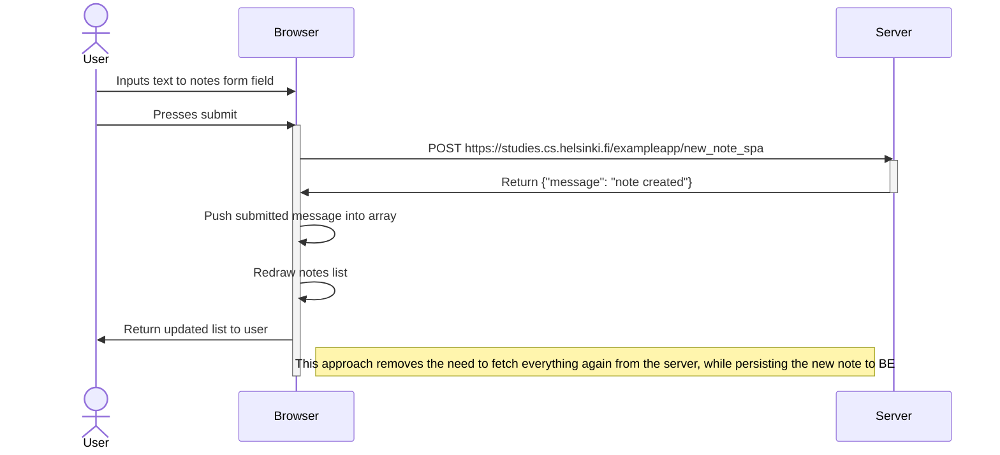

## Answer

```mermaid
  sequenceDiagram
    actor User;
    participant Browser;
    participant Server;

    User ->> Browser: Inputs text to notes form field;
    User ->> Browser: Presses submit
    activate Browser;
    Browser ->> Server: POST https://studies.cs.helsinki.fi/exampleapp/new_note_spa
    activate Server;
    Server ->> Browser: Return {"message": "note created"}
    deactivate Server;
    Browser ->> Browser: Push submitted message into array
    Browser ->> Browser: Redraw notes list

    Browser ->> User: Return updated list to user
    Note right of Browser: This approach removes the need to fetch everything again from the server, while persisting the new note to BE
    deactivate Browser;


```
